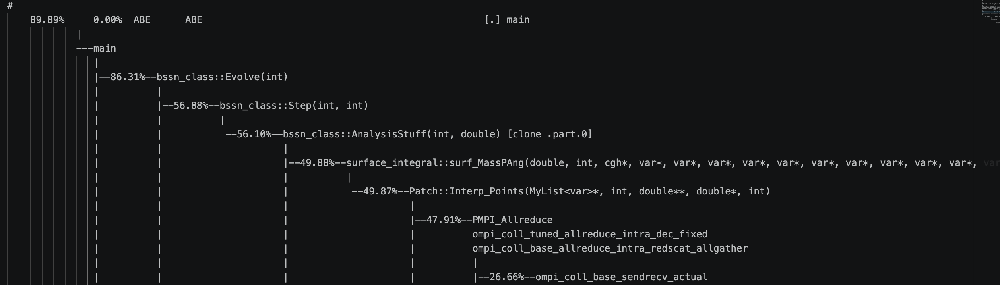

第一次尝试编译运行这个程序耗费大量经验，所以首先寻求更加优化的方案，能够保证每一次进行优化之后都能快速查看结果，于是创建了一个简易的脚本 **quick_test.sh** 

每次执行 
``` bash
root@h3250106538-lab41:~/HPC101/src/lab4# chmod +x quick_test.sh
root@h3250106538-lab41:~/HPC101/src/lab4# hpc submit ./quick_test.sh
```
提交

``` bash
#!/bin/bash
#HPC --partition=lab4
#HPC --cpu=60
#HPC --mem=100Gi
#HPC --time=30m

set -euo pipefail

echo "==================================================="
echo "🚀 开始 AMSS-NCKU 快速敏捷测试 (Agile Workflow)"
echo "==================================================="

# 1. 设定测试标识与归档目录 (按当前时间戳生成文件夹)
RUN_ID=$(date +%Y%m%d_%H%M%S)
SAVE_DIR="test_archives/run_${RUN_ID}"
mkdir -p "$SAVE_DIR"

echo "[1/6] 环境初始化与配置 (归档至: $SAVE_DIR)"

# 备份原配置 (保证测试后环境不会被弄脏)
cp AMSS_NCKU_Input.py AMSS_NCKU_Input.py.bak

# 强制开启 CPU 测试，并锁定极短演化时间 (t=2.0)，确保 3 分钟内出结果
sed -i -E 's/^(GPU_Calculation[[:space:]]*=[[:space:]]*).*/\1"no"/' AMSS_NCKU_Input.py
sed -i -E 's/^(Final_Evolution_Time[[:space:]]*=[[:space:]]*).*/\12.0/' AMSS_NCKU_Input.py

# ==============================================================
# ⚠️ 调优参数修改区：每次优化时，你只需要修改这里的数字
# ==============================================================
export AMSS_MPI_PROCESSES=30       # 纯 MPI 基线是 30。后续加入 OpenMP 时，可改为 5
export AMSS_OMP_THREADS=1          # 后续加入 OpenMP 时，可改为 6
export AMSS_ENABLE_OPENMP=ON       # 开启 OpenMP 编译支持 (非常关键)
export AMSS_ENABLE_GPU=OFF
export AMSS_GPU_CALCULATION=no
export AMSS_BUILD_DIR="$PWD/build"
export AMSS_OUTPUT_ROOT="$PWD"
export AMSS_CACHE_DIR="$PWD/twopuncture_cache"
unset CUDACXX AMSS_CUDA_ARCHITECTURES
# ==============================================================

# 2. 编译代码 (将编译日志存入文件夹，不在屏幕刷屏)
echo "[2/6] 正在编译代码..."
./compile.sh > "${SAVE_DIR}/compile.log" 2>&1 || { echo "❌ 编译失败，请查看 ${SAVE_DIR}/compile.log"; mv AMSS_NCKU_Input.py.bak AMSS_NCKU_Input.py; exit 1; }

# 3. 运行程序 (同时将输出显示在终端并写入日志)
echo "[3/6] 正在运行演化程序 (t=2.0) 并复用初值缓存..."
LOG_FILE="${SAVE_DIR}/running.log"
./run.sh --twop-cache 2>&1 | tee "$LOG_FILE"

# 4. 截断 Golden 数据，防误报 FAIL
echo "[4/6] 适配 2.0 秒的黄金参考数据..."
FINAL_TIME=$(python3 -c 'import AMSS_NCKU_Input as cfg; print(cfg.Final_Evolution_Time)')
mkdir -p golden_cpu
awk -v cutoff="$FINAL_TIME" '
  /^[[:space:]]*#/ || NF == 0 { print; next }
  ($1 + 0) <= cutoff { print }
' golden/bssn_BH.dat > golden_cpu/bssn_BH.dat

# 5. 执行正确性校验 (日志存入归档文件夹)
echo "[5/6] 执行物理精度校验..."
CHECK_LOG="${SAVE_DIR}/check.log"
./check.sh GW250118/AMSS_NCKU_output golden_cpu > "$CHECK_LOG" 2>&1

# 6. 提取结果归档与清理
echo "[6/6] 整理数据并恢复环境..."
# 把包含轨迹和误差的重要 .dat 文件备份进去
cp GW250118/AMSS_NCKU_output/binary_output/*.dat "$SAVE_DIR/" 2>/dev/null || true
# 恢复最初的配置文件
mv AMSS_NCKU_Input.py.bak AMSS_NCKU_Input.py

echo ""
echo "==================================================="
echo "🎯 测试完成! 快速性能核心简报:"
echo "==================================================="
echo "📁 详细日志与数据保存至: $SAVE_DIR"
echo "---------------------------------------------------"

# 自动抓取并高亮【第一步耗时】（判断算子优化是否有效就看这个）
T1_TIME=$(grep -m 1 "Timestep # 1: integrating to time:" "$LOG_FILE" || echo "未找到单步耗时记录")
echo "⏱️  算子单步性能: $T1_TIME"

# 自动抓取并高亮【总耗时】
TOTAL_TIME=$(grep "This Program Cost" "$LOG_FILE" || echo "未找到总耗时记录")
echo "⏱️  端到端总耗时: $TOTAL_TIME"
echo "---------------------------------------------------"

# 自动抓取正确性评判
TRAJ_RES=$(grep "Trajectory:" "$CHECK_LOG" || echo "未找到轨迹比对")
CONS_RES=$(grep "Constraints: PASS" "$CHECK_LOG" || echo "未找到约束比对")
FINAL_RES=$(grep "FINAL:" "$CHECK_LOG" || echo "FINAL: 状态未知")
echo "🧪 精度检查结果:"
echo "   - $TRAJ_RES"
echo "   - $CONS_RES"
echo "   - $FINAL_RES"
echo "==================================================="
```

初步尝试优化后运行输出结果为：
``` bash
===================================================
🎯 测试完成! 快速性能核心简报:
===================================================
📁 详细日志与数据保存至: test_archives/run_20260814_061929
---------------------------------------------------
⏱️  算子单步性能:  Timestep # 1: integrating to time: 1    Computer used 34.2979 seconds! 
⏱️  端到端总耗时:  This Program Cost = 70.09357166290283 Seconds
---------------------------------------------------
🧪 精度检查结果:
   - Trajectory: matched times 2/2, effective terms 8
Trajectory: PASS - RMS <= 0.001 (0.100000%)
   - Constraints: PASS - all maxima <= 2
   - FINAL: PASS
===================================================
```

同时创建了一个性能分析采样的脚本 pert_analysis 用于性能分析
``` bash
#!/bin/bash
#HPC --partition=lab4
#HPC --cpu=60
#HPC --mem=100Gi
#HPC --time=30m

set -euo pipefail

# Submit this file from the lab4 project root:
#   hpc submit ./perf_analysis.sh
# AMSS_NCKU_Input.py should use the short CPU configuration:
# GPU_Calculation="no" and Final_Evolution_Time=2.0.
PROJECT_DIR="${PWD}"
cd "${PROJECT_DIR}"

if [[ ! -x ./compile.sh || ! -x ./run.sh ]]; then
  echo "ERROR: perf_analysis.sh must be located in the lab4 project root." >&2
  exit 2
fi

RUN_ID="$(date +%Y%m%d_%H%M%S)"
OUT_DIR="${PROJECT_DIR}/test_archives/perf_${RUN_ID}"
BUILD_DIR="${OUT_DIR}/build"
mkdir -p "${OUT_DIR}"

export AMSS_ENABLE_OPENMP=ON
export AMSS_ENABLE_GPU=OFF
export AMSS_GPU_CALCULATION=no
export AMSS_BUILD_DIR="${BUILD_DIR}"
export AMSS_ABE_OMP_THREADS="${AMSS_ABE_OMP_THREADS:-1}"
export AMSS_CACHE_DIR="${PROJECT_DIR}/twopuncture_cache"
unset CUDACXX AMSS_CUDA_ARCHITECTURES

echo "Output directory: ${OUT_DIR}"
echo "Building..."
./compile.sh > "${OUT_DIR}/compile.log" 2>&1

echo "Running perf stat..."
export AMSS_OUTPUT_ROOT="${OUT_DIR}/stat_run"
mkdir -p "${AMSS_OUTPUT_ROOT}"
STAT_START="$(date +%s)"
set +e
perf stat -o "${OUT_DIR}/perf.stat" \
  -e cycles,instructions,branches,branch-misses,cache-references,cache-misses \
  ./run.sh --twop-cache > "${OUT_DIR}/application.log" 2>&1
STAT_RC=$?
set -e
STAT_END="$(date +%s)"
echo "$((STAT_END - STAT_START))" > "${OUT_DIR}/perf_stat_wall_seconds.txt"
echo "perf stat exit code: ${STAT_RC}"

echo "Running perf record..."
# Sample the complete driver process tree. perf inherits into mpiexec and its
# ABE ranks, while --twop-cache avoids profiling TwoPuncture initialization.
export AMSS_OUTPUT_ROOT="${OUT_DIR}/record_run"
mkdir -p "${AMSS_OUTPUT_ROOT}"
RECORD_START="$(date +%s)"
set +e
perf record -m 4 -F 99 -g -o "${OUT_DIR}/perf.data" \
  -- ./run.sh --twop-cache > "${OUT_DIR}/perf_record.log" 2>&1
RECORD_RC=$?
set -e
RECORD_END="$(date +%s)"
echo "$((RECORD_END - RECORD_START))" > "${OUT_DIR}/perf_record_wall_seconds.txt"
echo "perf record exit code: ${RECORD_RC}"

{
  echo "===== Timing ====="
  grep -E "Before Evolve|Timestep #|This Program Cost" \
    "${OUT_DIR}/application.log" || true
  echo "perf stat wall seconds: $(cat "${OUT_DIR}/perf_stat_wall_seconds.txt")"
  echo "perf record wall seconds: $(cat "${OUT_DIR}/perf_record_wall_seconds.txt")"
  echo "perf stat exit code: ${STAT_RC}"
  echo "perf record exit code: ${RECORD_RC}"
  echo "===== perf stat ====="
  cat "${OUT_DIR}/perf.stat" || true
  echo "===== Top symbols ====="
  if [[ -s "${OUT_DIR}/perf.data" ]]; then
    perf report --stdio -i "${OUT_DIR}/perf.data" --sort comm,dso,symbol \
      2>/dev/null | sed -n '1,100p' || true
  else
    echo "No perf.data was produced; inspect perf_record.log."
  fi
} | tee "${OUT_DIR}/summary.txt"

echo "Performance results saved in: ${OUT_DIR}"

if (( STAT_RC != 0 || RECORD_RC != 0 )); then
  echo "WARNING: one or more perf commands failed; see summary.txt and logs." >&2
  exit 1
fi

```
这两个的输出结果均维护在一个日志文件夹下

执行后结果显示 IPC = 1.97， 缓存为命中率也比较低，但是 PMPI_Allreduce 占程序的时间占比达到了 66.6%，



尝试修改了MPI 和 OMP 的比例为15*2，取得明显优化。
